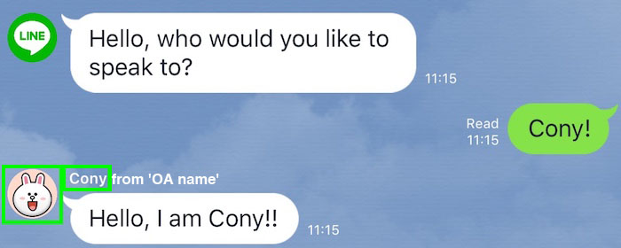
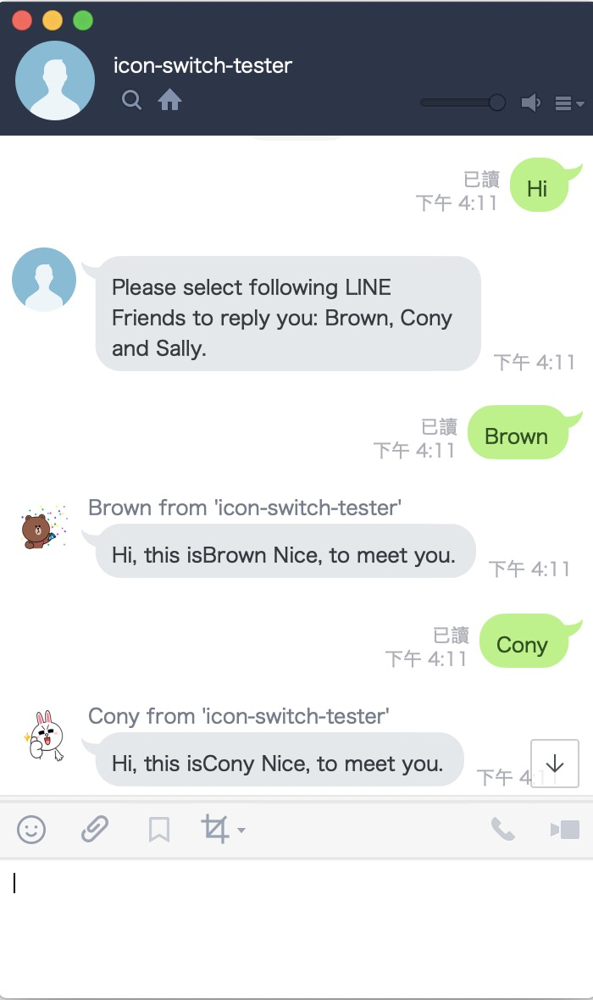

LINE Bot Icon/Nick Name Swtich demo: Sample code how to use Icon/Nick name switch in LINE Bot in Go
==============

    

Icon / Nick name Switch in LINE Bot
=============

Icon.Nick name switch is new feature of LINE Bot open for public in 2020/03/17. (Please refer this [news](https://developers.line.biz/zh-hant/news/2020/03/17/icon-nickname-switch/) )

### Reference:

- [LINE Official Open Stickers](https://developers.line.biz/media/messaging-api/sticker_list.pdf)

How to Use it
=============

- Add this OA.
- Input any text.
- LINE Bot will notify you input "Brown", "Cony" or "Sally".
- Input anyone to reply you.

Installation and Usage
=============

### 1. Got A LINE Bot API devloper account

[Make sure you already registered](https://business.line.me/zh-hant/services/bot), if you need use LINE Bot.

  

### 2. Go to LINE Developer Console

2.1 Close auto-reply setting on "Messaging API" Tab.

2.2 Setup your basic account information. Here is some info you will need to know.

- `Callback URL`: https://{YOUR_HEROKU_SERVER_ID}.herokuapp.com:443/callback
- Verify your webhook.

2.3 You will get following info, need fill back to Heroku.

- Channel Secret
- Channel Access Token (You need to issue one here)

### 3. Just Deploy the same on Heroku

- Input `CHANNEL_SECRET` and `CHANNEL_TOKEN` from LINE Developer Console.

Remember your heroku, ID.

It all done.

License
---------------

Licensed under the Apache License, Version 2.0 (the "License");
you may not use this file except in compliance with the License.
You may obtain a copy of the License at

http://www.apache.org/licenses/LICENSE-2.0

Unless required by applicable law or agreed to in writing, software
distributed under the License is distributed on an "AS IS" BASIS,
WITHOUT WARRANTIES OR CONDITIONS OF ANY KIND, either express or implied.
See the License for the specific language governing permissions and
limitations under the License.

